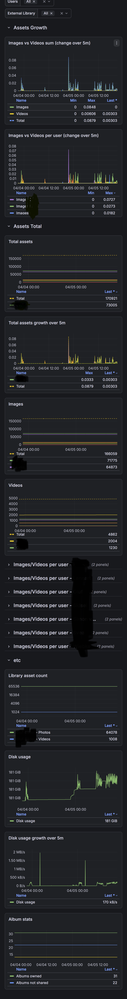

# Immich Prometheus Exporter

A Python script that exports Immich statistics as Prometheus metrics using the Immich OpenAPI specification.

## Grafana

[Dashboard.json](/grafana/immic-stats-dashboard.json)



## Features

This exporter collects and exports the following metrics:

### User Metrics
- `immich_user_total_assets` - Total number of assets per user
- `immich_user_images_count` - Number of images per user  
- `immich_user_videos_count` - Number of videos per user
- `immich_user_quota_bytes` - User quota in bytes (if configured)
- `immich_user_quota_usage_bytes` - User quota usage in bytes (if configured)

### Album Metrics
- `immich_albums_owned_total` - Total number of albums owned by users
- `immich_albums_shared_total` - Total number of shared albums
- `immich_albums_not_shared_total` - Total number of albums not shared

### Library Metrics
- `immich_library_total_assets` - Total number of assets per library
- `immich_library_photos_count` - Number of photos per library
- `immich_library_videos_count` - Number of videos per library
- `immich_library_usage_bytes` - Library usage in bytes

### Storage Metrics
- `immich_storage_disk_size_bytes` - Total disk size in bytes
- `immich_storage_disk_use_bytes` - Used disk space in bytes
- `immich_storage_disk_available_bytes` - Available disk space in bytes
- `immich_storage_disk_usage_percentage` - Disk usage percentage

### System Metrics
- `immich_exporter_last_scrape_timestamp_ms` - Timestamp of last successful scrape

## Requirements

- Python 3.7+
- `typer` and `requests` libraries (included in requirements.txt)
- Immich server with API access
- Admin API key for accessing user statistics

## Installation

### Option 1: Install as a Package (Recommended)

1. Clone or download this repository
2. Install the package:
   ```bash
   pip install .
   ```
   
   Or for development:
   ```bash
   pip install -e .
   ```

### Option 2: Install Dependencies Only

1. Clone or download this repository
2. Install dependencies:
   ```bash
   pip install -r requirements.txt
   ```

## Usage

### Basic Export (one-time)

**If installed as a package:**
```bash
immich-prometheus-exporter export --url http://localhost:2283 --api-key YOUR_API_KEY
```

**If running directly:**
```bash
python3 immich-prometheus-exporter.py export --url http://localhost:2283 --api-key YOUR_API_KEY
```

Export metrics to a file:
```bash
immich-prometheus-exporter export --url http://localhost:2283 --api-key YOUR_API_KEY --output metrics.txt
```

### Continuous Export

Export metrics every 60 seconds:
```bash
immich-prometheus-exporter export --url http://localhost:2283 --api-key YOUR_API_KEY --interval 60
```

### Test Connection

Test your connection and API key:
```bash
immich-prometheus-exporter test-connection --url http://localhost:2283 --api-key YOUR_API_KEY
```

### Command Line Options

- `--url`, `-u`: Immich server URL (required)
- `--api-key`, `-k`: Immich API key (required)
- `--output`, `-o`: Output file path (optional, defaults to stdout)
- `--interval`, `-i`: Continuous export interval in seconds (optional)

### Help

Get help for all commands:
```bash
immich-prometheus-exporter --help
```

Get help for a specific command:
```bash
immich-prometheus-exporter export --help
```

## API Key Setup

1. Log into your Immich web interface
2. Go to Account Settings → API Keys
3. Create a new API key with the following permissions:
   - **Name:** `statistics_server_system_adminread` (or any descriptive name)
   - **Required Permissions:**
     - `activity.statistics` - Access to activity statistics
     - `asset.statistics` - Access to asset statistics  
     - `album.statistics` - Access to album statistics
     - `library.statistics` - Access to library statistics
     - `memory.statistics` - Access to memory statistics
     - `person.statistics` - Access to person statistics
     - `server.statistics` - Access to server statistics
     - `server.about` - Access to server information
     - `server.storage` - Access to storage information
     - `adminUser.read` - Read access to admin user data
     - `library.read` - Read access to library data
4. Copy the generated key and use it with the `--api-key` parameter

**Note:** The API key must have admin privileges and the specific permissions listed above to access all user statistics, library information, and system metrics that this exporter collects.

## Prometheus Integration

### Using with Prometheus

Add this job to your `prometheus.yml`:

```yaml
scrape_configs:
  - job_name: 'immich'
    static_configs:
      - targets: ['localhost:8000']  # Adjust as needed
    scrape_interval: 60s
```

### Running as HTTP Server

You can use a simple HTTP server to serve the metrics:

```bash
# Export to file every 30 seconds (using installed package)
immich-prometheus-exporter export --url http://localhost:2283 --api-key YOUR_API_KEY --output /tmp/immich_metrics.txt --interval 30 &

# Serve the file via HTTP
cd /tmp && python3 -m http.server 8000
```

Then Prometheus can scrape from `http://localhost:8000/immich_metrics.txt`

### Docker Usage

The project includes a Dockerfile that installs the package properly. Build and run:

```bash
docker build -t immich-exporter .
docker run -e IMMICHEXPORTER_EXPORT_URL=http://your-immich-server:2283 -e IMMICHEXPORTER_EXPORT_API_KEY=your-api-key immich-exporter
```

Or use docker-compose:

```bash
docker-compose up
```

### Environment Variables

The exporter supports environment variables with the prefix `IMMICHEXPORTER_`. Each command has its own set of environment variables:

#### Global Options
- `IMMICHEXPORTER_INSTALL_COMPLETION` - Install completion for the current shell
- `IMMICHEXPORTER_SHOW_COMPLETION` - Show completion for the current shell

#### Export Command
- `IMMICHEXPORTER_EXPORT_URL` - Immich server URL (required)
- `IMMICHEXPORTER_EXPORT_API_KEY` - Immich API key (required)
- `IMMICHEXPORTER_EXPORT_OUTPUT` - Output file path (optional)
- `IMMICHEXPORTER_EXPORT_INTERVAL` - Continuous export interval in seconds (optional)
- `IMMICHEXPORTER_EXPORT_LOG_LEVEL` - Logging level (default: INFO)
- `IMMICHEXPORTER_EXPORT_LOG_FILE` - Log file path (optional)
- `IMMICHEXPORTER_EXPORT_LOG_TO_STDOUT` - Log to stdout instead of stderr (optional)

#### Serve Command
- `IMMICHEXPORTER_SERVE_URL` - Immich server URL (required)
- `IMMICHEXPORTER_SERVE_API_KEY` - Immich API key (required)
- `IMMICHEXPORTER_SERVE_PORT` - Port to serve metrics on (default: 8000)
- `IMMICHEXPORTER_SERVE_LOG_LEVEL` - Logging level (default: INFO)
- `IMMICHEXPORTER_SERVE_LOG_FILE` - Log file path (optional)

#### Test Connection Command
- `IMMICHEXPORTER_TEST_CONNECTION_URL` - Immich server URL (required)
- `IMMICHEXPORTER_TEST_CONNECTION_API_KEY` - Immich API key (required)

#### Example Usage with Environment Variables

```bash
# Export using environment variables
export IMMICHEXPORTER_EXPORT_URL=http://localhost:2283
export IMMICHEXPORTER_EXPORT_API_KEY=your-api-key
export IMMICHEXPORTER_EXPORT_INTERVAL=60
immich-prometheus-exporter export

# Serve using environment variables
export IMMICHEXPORTER_SERVE_URL=http://localhost:2283
export IMMICHEXPORTER_SERVE_API_KEY=your-api-key
export IMMICHEXPORTER_SERVE_PORT=8000
immich-prometheus-exporter serve
```

## Example Output

```
# HELP immich_exporter_last_scrape_timestamp_ms Timestamp of last successful scrape
# TYPE immich_exporter_last_scrape_timestamp_ms gauge
immich_exporter_last_scrape_timestamp_ms 1704067200000

# HELP immich_user_total_assets Total number of assets for user
# TYPE immich_user_total_assets gauge
immich_user_total_assets{user_id="123e4567-e89b-12d3-a456-426614174000",user_name="john_doe",user_email="john@example.com"} 1250

# HELP immich_user_images_count Number of images for user
# TYPE immich_user_images_count gauge
immich_user_images_count{user_id="123e4567-e89b-12d3-a456-426614174000",user_name="john_doe",user_email="john@example.com"} 1000

# HELP immich_user_videos_count Number of videos for user
# TYPE immich_user_videos_count gauge
immich_user_videos_count{user_id="123e4567-e89b-12d3-a456-426614174000",user_name="john_doe",user_email="john@example.com"} 250

# HELP immich_albums_owned_total Total number of albums owned by users
# TYPE immich_albums_owned_total gauge
immich_albums_owned_total 15

# HELP immich_storage_disk_size_bytes Total disk size in bytes
# TYPE immich_storage_disk_size_bytes gauge
immich_storage_disk_size_bytes 1000000000000
```

## Troubleshooting

### Connection Issues
- Verify your Immich server URL is correct and accessible
- Check that your API key is valid and has admin privileges
- Ensure Immich server is running and responding

### Permission Issues
- Make sure your API key has admin privileges
- Some endpoints require specific permissions - check Immich logs for details

### Missing Metrics
- If user quotas are not configured, quota metrics won't appear
- Libraries are only available if you have external libraries configured
- Some metrics may be 0 if no data exists

## Development

The script is built using:
- **typer** for CLI interface
- **requests** for HTTP requests (reliable and user-friendly HTTP library)
- **json** for API response parsing
- Type hints for better code quality

## License

MIT, see LICENSE.md
